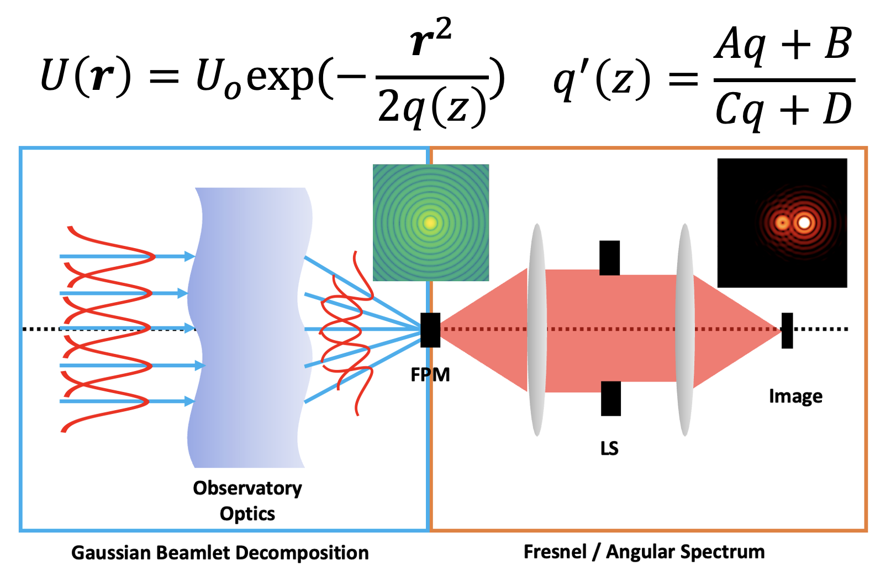

# An Open-Source Gaussian Beamlet Decomposition Tool for Modeling Astronomical Telescopes

A repository tracking the development of a GBD package to simulate the PSF of astronomical observatories outfitted with coronagraphs. 

For diffraction-limited optical systems an accurate physical optics model is necessary to properly evaluate instrument performance. Astronomical observatories outfitted with coronagraphs require physical optics models to simulate the effects of misalignment, diffraction, and polarization. Accurate knowledge of the observatory's point-spread function (PSF) is integral for the design of high-contrast imaging instruments and simulation of astrophysical observations. The state of the art models the misalignment, ray aberration, and diffraction model across multiple software packages, which complicates the design process. This research proposes to update an existing, powerful open-source optical analysis software (**POPPY**) with new propagation physics to better integrate the geometrical and physical regimes of the optical field. 

*Gaussian Beamlet Decomposition* is a ray-based method of diffraction calculation that has been widely implemented in commercial optical design software. By performing the coherent calculation with data from the ray model of the observatory the ray aberration errors can be fed directly into the physical optics model of the coronagraph, enabling better integration of the observatory model with the coronagraph.

### Papers
[1] Jaren N. Ashcraft, Ewan S. Douglas, "An open-source Gaussian beamlet decomposition tool for modeling astronomical telescopes," Proc. SPIE 11450, Modeling, Systems Engineering, and Project Management for Astronomy IX, 114501D (13 December 2020); https://doi.org/10.1117/12.2561921

[2] Jaren N. Ashcraft, Ewan S. Douglas, Daewook Kim, A.J. Riggs, "Hybrid Propagation Physics for The Design and Modeling of Astronomical Observatories Outfitted with Coronagraphs" *in prep*
